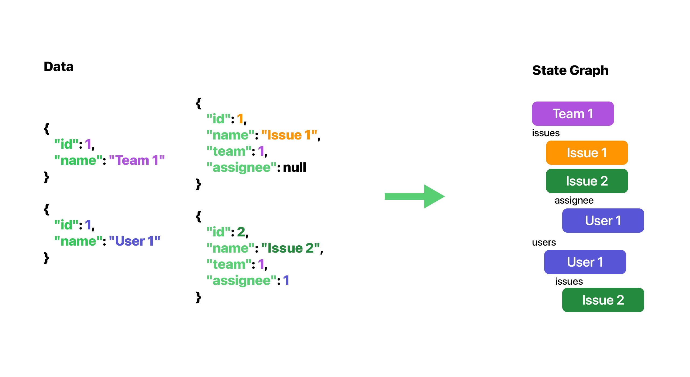

# ⚡ Realtime Sync
*realtime-sync* is a NodeJS package that allows for real-time sync, offline support, and conflict resolution for any data source. It works with any backend, any database, and any client framework. It's designed to be easy to use and easy to extend.

| :warning: | This project is currently in development and not yet ready for production use. |
| - |:-|



## Installation
```bash
npm install realtime-sync
```

## Features
- Real-time sync
- Offline support
- Conflict resolution

## Usage
```typescript
// Declare your models
import { ClientModel, Collection, Computed, Model, OneToMany, Property } from "realtime-sync";

@ClientModel({ name: "Organization" })
export default class Organization extends Model {
    @Property()
    public id: string;

    @Property()
    public name: string;

    @OneToMany(() => User)
    public readonly members = new Collection<User>()

    @OneToMany(() => Team)
    public readonly teams = new Collection<Team>()

    @Computed()
    get items(): Issue[] {
        return this.teams.flatMap((team) => team.issues.items)
    }
}

// Declare the root node and create a state graph
import { StateGraph, createStateGraph } from 'realtime-sync';

const organization = { id: "1", name: 'Acme Inc.' } // root node

const graph: StateGraph<Organization> = createStateGraph(
    [Organization, Team, User, Issue], // models
    { type: 'Organization', ...organization }, // root node
    true // should auto-perform transactions
)

// Add new node to the graph (gotten from the server/web-socket)
graph.add({ type: 'User', ...userData })

// Get nodes from the graph
const user: User = graph.get<User>(User, '1')!
const users: Map<string, User> = graph.getAll<User>(User)!
const users: User[] = graph.getAllArray<User>(User)!
```

```typescript
// You can now use the data directly in your components using MobX (e.g. React)
import { observer } from 'mobx-react-lite';

// This component will re-render automatically when the user's name changes
const UserComponent = observer(({ user: User }) => {
    return <div>{user.name}</div>
})
```
